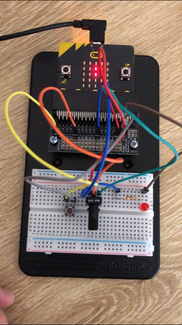
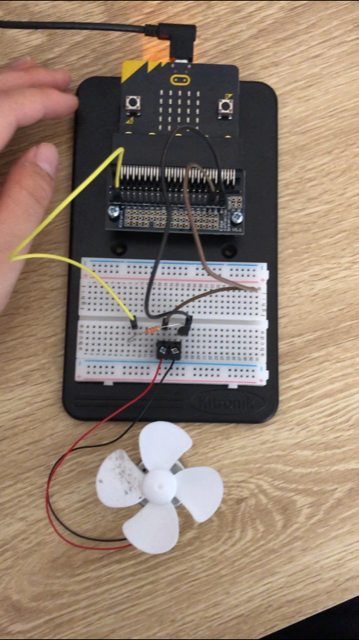
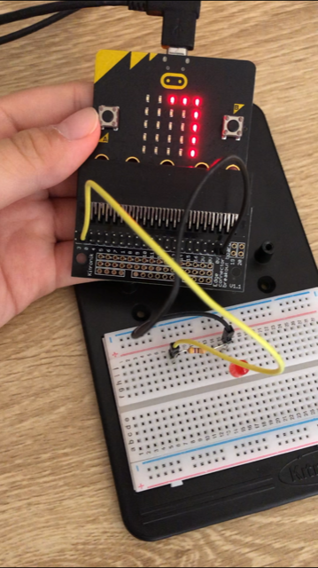

# Inventor Kit Experiments

*Markdown reference: https://guides.github.com/features/mastering-markdown/*

## Instructions ##

*For a selection of 5 inventor kit experiments that you choose, fill out the following sections.

### Experiment Three - Dimming an LED using a potentiometer ###

#### Photo of completed project ####

#### Reflection ####

In this experiment, something I learned was the variable between 1 and 0 means on and off.

This experiment could be the basis of a real world application such as (insert something here).

This experiment could be the basis of a real world application such as the manipulation of brightess lik stage lights or night lights or just switching the light on at home.

### Experiment Four - Using a Transistor to Drive a Motor ###

#### Photo of completed project ####

(Insert a caption here)

#### Reflection ####

In this experiment, something new to me was or something I learned was (insert something here).

In this experiment, something new to me was the loop block "while do" and the math block "__ + __". To my understanding, the 'while do' blocks are to 

In this experiment, 

This experiment could be the basis of a real world application such as (insert something here).

This experiment could be the basis of a real world application such as 

### Experiment Five - Using the Accelerometer to Control Motor Speed ###

(Replace this with the experiment name)

#### Photo of completed project ####
In the code below, replace imagemissing.jpg with the name of the image, which should be in the kitexperiments folder.

(Insert a caption here)

#### Reflection ####

In this experiment, something new to me was or something I learned was (insert something here).

This experiment could be the basis of a real world application such as (insert something here).

### Experiment Six - Setting the Tone with a Piezo Buzzer ###

(Replace this with the experiment name)

#### Photo of completed project ####
In the code below, replace imagemissing.jpg with the name of the image, which should be in the kitexperiments folder.

(Insert a caption here)

#### Reflection ####

In this experiment, something new to me was or something I learned was (insert something here).

This experiment could be the basis of a real world application such as (insert something here).

### Experiment Eight - Making a Game using the Compass ###

(Replace this with the experiment name)

#### Photo of completed project ####
In the code below, replace imagemissing.jpg with the name of the image, which should be in the kitexperiments folder.

(Insert a caption here)

#### Reflection ####

In this experiment, something new to me was or something I learned was (insert something here).

This experiment could be the basis of a real world application such as (insert something here).

