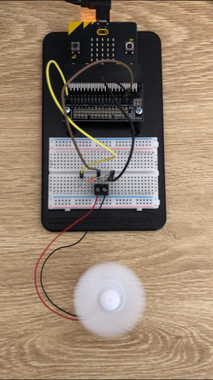

# Inventor Kit Experiments

*Markdown reference: https://guides.github.com/features/mastering-markdown/*

## Instructions ##

*For a selection of 5 inventor kit experiments that you choose, fill out the following sections.

### Experiment Three ###

Dimming an LED using a potentiometer

#### Photo of completed project ####

Setup of the experiment

#### Reflection ####

Something I learned was what the pins are, how to use the "analog write to pin", "digital write to pin" and the variable between 1 and 0 meaning on and off. The pins are the numbers 0, 1 and 2 on the microbit and the numbers on the edge connector. In the experiment, the "analog write to pin" is used to change the brightness of the external LED connected to P2 when the potentiometer connected to P1 is altered if the light state is on. Otherwise, if the lightstate is already on, the lightstate will be turned off. Then the "digital write to pin" is used to have the LED off otherwise if it is not on. The light state is turned on and off through the "on pin P0 pressed, if 'light state' = 0 then set 'lightstate' to 1 else set 'light state' to 0" which means when the push switch (which is connected to P0) is pressed, if the lightstate on the external LED is already off than the lightstate will go on.

This experiment could be the basis of a real world application such as the stage lights, night lights for the controling the brightness of lights or just switching the light on at home for the on and off function.

### Experiment Four ###

Using a Transistor to Drive a Motor

#### Photo of completed project ####

Setup for experiment with fan moving

#### Reflection ####

In this experiment, something new to me was the loop block "while do" and the math block "_+_." To my understanding, the 'while do' blocks in the experiment means when the speed of the fan is lower than 1023 which is the maximum speed, the fan must continue to spin through the "'Duty'+ 1" block until it reaches higher than 1023. Then the second 'while do' block means when the speed is higher than 0, the fan reduces speed through the "'Duty' - 1" block until it reaches lower than 0 which the fan is stopped. This cycle is done again as it is in the forever loop.

This experiment could be the basis of a real world application such as (insert something here).

### Experiment Five ###

Using the Accelerometer to Control Motor Speed

#### Photo of completed project ####

Same setup as experiment four

#### Reflection ####

Something new to me was the "absolute of" block and the "acceleration" block. I think the "absolute of" block is supposed to detect the movement of the pin P0 and the "acceleration (mg)''y" block spins the fan at maximum speed when tilt upright.

This experiment could be the basis of a real world application such as (insert something here).

### Experiment Six ###

Setting the Tone with a Piezo Buzzer

#### Photo of completed project ####

Setup of experiment

#### Reflection ####

Something new to me was the piezo element buzzer, "play tone" and the "start melody" block. In the experiment, the "play tone" block is used to play a single note and the "start melody" block is used to play the default melodies that are avaliable in the dropdown of the block on the piezo element buzzer which is connected to the P0. 

This experiment could be the basis of a real world application such as speakers.

### Experiment Eight ###

Making a Game using the Compass

#### Photo of completed project ####
In the code below, replace imagemissing.jpg with the name of the image, which should be in the kitexperiments folder.

Setup of experiment while the microbit is calibrating

#### Reflection ####

Something new to me was creating javascript codes instead of the MakeCode Editor. Before putting the code into the microbit, I tried to transfer it to the MakeCode Editor to see how it would look like if it was done there. The first attempt I tried didn't work as I didn't notice there was a code that wasn't highlighted right because it was not correctly selected through the code that appears while being typed down. I also made sure that I was using the right code for the "math.random" becoming "math.randomrange" due to the updates, and it worked.

This experiment could be the basis of a real world application such as a toy.

