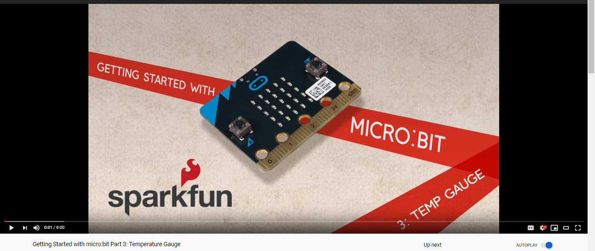
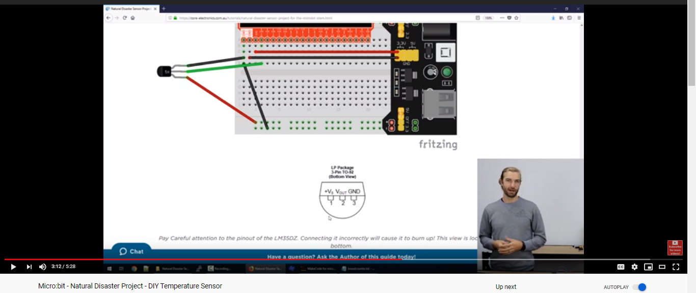

# Assessment 1: Replication project

*Fill out the following workbook with information relevant to your project.*

*Markdown reference:* [https://guides.github.com/features/mastering-markdown/](http://guides.github.com/features/mastering-markdown/)

## Temperature Gauge ##

## Related projects ##
*Find about 6 related projects to the project you choose. A project might be related through  function, technology, materials, fabrication, concept, or code. Don't forget to place an image of the related project in the* `replicationproject` *folder and insert the filename in the appropriate places below. Copy the markdown block of code below for each project you are showing, updating the number* `1` *in the subtitle for each.*

I had trouble finding four more projects as 

### Temperature Gauge How to ###

(https://www.hackster.io/anish78/how-to-create-temperature-gauge-using-micro-bit-a601cc)

This project is related to mine as it is the same concept that I have chosen for the assignment.

## Heat Activated Fan ##

(https://www.youtube.com/watch?v=iilfeimMDjM)

This project is related to mine because in the assignment, as it helped me get an idea of how a fan would automatically turn on and show how it is set up on the breadboard which I noticed has the same set up for all the experiments in the tutorial book.

## Micro Bit Temperature Gauge ##

(https://www.youtube.com/watch?v=Hi3Km1PV45M)

This project is similar to the first project however, related to mine because it helped me in how the microbit would function with the temperature reading and the servo movement which is not shown in the first.

## ##

(https://www.youtube.com/watch?v=_T4N8O9xsMA)

This project is related to mine because

## Microbit Thermometer ##

(https://www.youtube.com/watch?v=-fZm1JCvxlE)

This project is related to mine because the concept is similar to it. 

## Natural Disaster Sensor Project ##

(https://www.youtube.com/watch?v=-tgD7r6M0c0)

This project is related to mine because it talks about the temperature sensor and how there are external sensors that could be used instead of the sensor in the microbit.

## Reading reflections ##
*Reflective reading is an important part of actually making your reading worthwhile. Don't just read the words to understand what they say: read to see how the ideas in the text fit with and potentially change your existing knowledge and maybe even conceptual frameworks. We assume you can basically figure out what the readings mean, but the more important process is to understand how that changes what you think, particularly in the context of your project.*

*For each of the assigned readings, answer the questions below.*

### Reading: Don Norman, The Design of Everyday Things, Chapter 1 (The Psychopathology of Everyday Things) ###

*What I thought before: Describe something that you thought or believed before you read the source that was challenged by the reading.*

I was used to interacting with objects without thinking much of it.

*What I learned: Describe what you now know or believe as a result of the reading. Don't just describe the reading: write about what changed in YOUR knowledge.*

I never realised how important labels are in signifying how to interact with an object being that they must be easy to understand. It is also significant to think about how the design will and will not work such as the sink or the stair shaft. 

*What I would like to know more about: Describe or write a question about something that you would be interested in knowing more about.*

What other objects are there that fail to communicate the interaction.

*How this relates to the project I am working on: Describe the connection between the ideas in the reading and one of your current projects or how ideas in the reading could be used to improve your project.*

I should work on the design to make it easy to understand how to use by putting labels.

### Reading: Chapter 1 of Dan Saffer, Microinteractions: Designing with Details, Chapter 1 ###

*What I thought before: Describe something that you thought or believed before you read the source that was challenged by the reading.*

I have never thought about microinteractions.

*What I learned: Describe what you now know or believe as a result of the reading. Don't just describe the reading: write about what changed in YOUR knowledge.*

There are many microinteractions that I have never realised before.

*What I would like to know more about: Describe or write a question about something that you would be interested in knowing more about.*

What microinteractions are there in the newer devices such as the iphone 11 and the comparison between it with the older versions of the phone.

*How this relates to the project I am working on: Describe the connection between the ideas in the reading and one of your current projects or how ideas in the reading could be used to improve your project.*

On the start up, the servo could point to position 0 to show that it moves.

### Reading: Scott Sullivan, Prototyping Interactive Objects ###

*What I thought before: Describe something that you thought or believed before you read the source that was challenged by the reading.*

*What I learned: Describe what you now know or believe as a result of the reading. Don't just describe the reading: write about what changed in YOUR knowledge.*

*What I would like to know more about: Describe or write a question about something that you would be interested in knowing more about.*

*How this relates to the project I am working on: Describe the connection between the ideas in the reading and one of your current projects or how ideas in the reading could be used to improve your project.*

## Interaction flowchart ##
*Draw a flowchart of the interaction process in your project. Make sure you think about all the stages of interaction step-by-step. Also make sure that you consider actions a user might take that aren't what you intend in an ideal use case. Insert an image of it below. It might just be a photo of a hand-drawn sketch, not a carefully drawn digital diagram. It just needs to be legible.*

## Process documentation ##

*In this section, include text and images that represent the development of your project including sources you've found (URLs and written references), choices you've made, sketches you've done, iterations completed, materials you've investigated, and code samples. Use the markdown reference for help in formatting the material.*

Firstly, I needed to make the microbit be able to work with the servo and display the temperature using the pointer. The reference I used to do this was the website that was provided in the task sheet (https://www.hackster.io/anish78/how-to-create-temperature-gauge-using-micro-bit-a601cc). I followed the instructions as it is and was able to make it work. During the whole process, I put an input of when the A button is pressed, the temperature would be shown on the microbit leds so it would help me in identifying which direction the servo is pointing is considered warm or cold.

The next thing I needed to do was to be able to automatically turn the fan on at a certain temperature. I used the tutorial book to look back on the experiments and reference from youtube displaying a microbit heat-activating fan (https://www.youtube.com/watch?v=iilfeimMDjM) and a friend who showed me how they got their's to work similar to the youtube video. The youtube video did not provide me information on how to code which I got help from my friend. I saw that the position of the parts were the same as all the experiments using the fan in the book. I set the fan on P1 and did the same for the placements on the breadboard.

For the servo display of the temperature, I cut out a small piece of cardboard and wrapped it with paper as a small design choice. I used a whole puncher to cut out a whole and placed the piece in between the arrow and servo.

To cover up the breadboard, I used more cardboard to cut out two seperate pieces that make a box when combined. 

*This should have quite a lot of information!*

*There will likely by a dozen or so images of the project under construction. The images should help explain why you've made the choices you've made as well as what you have done. Use the code below to include images, and copy it for each image, updating the information for each.*

*Include screenshots of the code you have used.*

## Project outcome ##

*Complete the following information.*

### Temperature Gauge ###

### Project description ###

*In a few sentences, describe what the project is and does, who it is for, and a typical use case.*

The Temperature Gauge can measure the temperature of the air, and automatically turn the fan on if it hits above 35 degrees Celcius. The fan will be left on until it is under 30 degrees which then turns off.

The project is for people who are in need to cool down a bit.

A typical use case is for when it is hot, and you might not have a source of wind to cool down.

### Showcase image ###

*Try to capture the image as if it were in a portfolio, sales material, or project proposal. The project isn't likely to be something that finished, but practice making images that capture the project in that style.*

### Additional view ###

*Provide some other image that gives a viewer a different perspective on the project such as more about how it functions, the project in use, or something else.*

It can be a different kind of object to measure temperature.

### Reflection ###

*Describe the parts of your project you felt were most successful and the parts that could have done with improvement, whether in terms of outcome, process, or understanding.*

I had trouble trying to figure out how to make it automatically turn the fan on at a certain temperature while the servo was moving. I was still having trouble understanding how the microbit works even after doing the experiments as I was only just doing what it was written to do. After working through, I think I understand how it works better than when I started the project. I was also confused with how the temperature was displayed as on the provided website, there was a gif at the top of the page with the hot display being on the right side which is opposite to what I have even though I have done the same thing as them. I don't think it is a big issue but I wished to know why it is doing that for me. 

I could have chosen a different material for the whole object but I did not have a lot of supplies at home.
I'm not really satisfied with the design as I had an problem where the battery pack that connects to the microbit wasn't working anymore so I had to connect it to my laptop. But it was the best that I could do with the lack of materials that I had.

*What techniques, approaches, skills, or information did you find useful from other sources (such as the related projects you identified earlier)?*

The provided website helped me make the servo point in the direction of the temperature.

*What ideas have you read, heard, or seen that informed your thinking on this project? (Provide references.)*

Most of the projects in the related projects have helped me in how to make my project. And I have also looked at how the temperature sensor works on the microbit (https://www.youtube.com/watch?v=_T4N8O9xsMA).

*What might be an interesting extension of this project? In what other contexts might this project be used?*

The LEDs on the microbit could make a upset icon and make sound when the temperature is too high and make a happy faced icon when the temperature has cooled down or is in the right temperature. It could also make a sound when the fan turns off to indicate that.

This could be used as a toy playing around with temperature.

